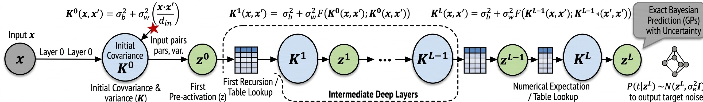

# 1 Overview

We implemented the Neural Network Gaussian Process (NNGP) method proposed by Lee et al. (2018) using *PyTorch*. Additionally, we implemented a chunk-wise kernel update strategy to bypass memory allocation bottlenecks during large-scale kernel computations.

## 1.1 Neural Networks as Gaussian Processes

Neural network Gaussian processes (NNGPs) are based on a surprising connection between deep neural networks and Gaussian processes. Neal (1996) showed that a single-hidden-layer neural network converges to a Gaussian process as the number of hidden neurons approaches infinity. Lee et al. (2018) extended this result to deep neural networks, showing that the same behavior holds when the width of every hidden layer tends to infinity.

Intuitively, instead of learning a single function by optimizing network weights, an NNGP defines a probability distribution over functions. The network architecture and activation function determine the covariance structure of this distribution.

A key advantage of NNGPs over standard multilayer perceptrons (MLPs) is that they naturally provide predictive uncertainty estimates. Lee et al. (2018) showed that these uncertainty estimates are strongly correlated with prediction error. A limitation, however, is that model performance depends heavily on hyperparameter choices, making external validation essential.

For a given set of hyperparameters ($\sigma_w^2$, $\sigma_b^2$, $\sigma_\epsilon^2$), the overall process can be summarized as follows:

- Normalize each input vector so that $\|x_i\| = 1$ for all $i$.
- Construct the initial kernel matrix using

$$
K^{0}(x,x')=\sigma_b^2 + \sigma_w^2\frac{x^\top x'}{d_{\text{in}}}.
$$

- For each layer $l=1,\dots,L$ and each pair of inputs $(x,x')$, update the kernel recursively as

$$
K^{l}(x,x')=\sigma_b^2 + \sigma_w^2 \mathbb{E}_{(u,v)\sim\mathcal N(0,\Sigma)} \big[\phi(u)\phi(v)\big].
$$

- Repeat this process to compute the training-training, training-test, and test-test kernels:

$$K_{DD}=K^L(X_{\mathrm{train}}, X_{\mathrm{train}})$$
$$K_{*D}=K^L(X*, X_{\mathrm{train}})$$
$$K_{**}=K^L(X*, X*).$$

- Use standard Gaussian process regression formulas to compute the predictive mean and covariance for the test set:

$$
\mu* = K_{*D}
(K_{DD}+\sigma_\epsilon^2 I)^{-1} t, \text{ and}
$$

$$
\Sigma_* =
K_{**}
-
K_{*D}
\left(K_{DD}+\sigma_{\epsilon}^2 I\right)^{-1}
K_{D*}.
$$

*Figure 1. As the width of each hidden layer approaches infinity, a randomly initialized neural network converges to a Gaussian process.*

## 1.2 Numerical Calculation of the Expectation

For the ReLU activation function, Cho and Saul (2009) derived a closed-form expression for the layer-to-layer kernel update. For most other activation functions, however, this expectation cannot be computed analytically and must instead be evaluated numerically.

A naive implementation computes this expectation separately for every pair of inputs at every layer, leading to a computational complexity of

$$
\mathcal{O}\left(n_g^2 L (n_{\mathrm{train}}^2+n_{\mathrm{train}}n_{\mathrm{test}})\right),
$$

where $n_{\mathrm{train}}$, $n_{\mathrm{test}}$, and $n_g$ denote the number of training samples, test samples, and integration grid points, respectively.

To address this issue, Lee et al. (2018) proposed a bilinear interpolation-based lookup method that reduces the computational complexity to

$$
\mathcal{O}\left(n_g^2 n_v n_c + L(n_{\mathrm{train}}^2+n_{\mathrm{train}}n_{\mathrm{test}})\right),
$$

where $n_v$ and $n_c$ are the grid sizes for variance and correlation values. The key idea is that the expensive Gaussian expectations are computed only once and then reused throughout the kernel recursion.

In this project, we precomputed the lookup table for the `tanh()` activation function, further reducing the online computational cost to

$$
\mathcal{O}\left(n_v n_c + L(n_{\mathrm{train}}^2+n_{\mathrm{train}}n_{\mathrm{test}})\right).
$$

The implementation is available in [grid_calculation.py](https://raw.githubusercontent.com/RezoanoorRahman/Infinitely-Wide-Deep-Neural-Network-in-Torch/main/scripts/grid_calculation.py), which can be adapted to generate lookup tables for other activation functions.

For a detailed theoretical treatment, see [Deep_NNGP.pdf](https://github.com/RezoanoorRahman/Infinitely-Wide-Deep-Neural-Network-in-Torch/blob/main/Deep_NNGP.pdf).

